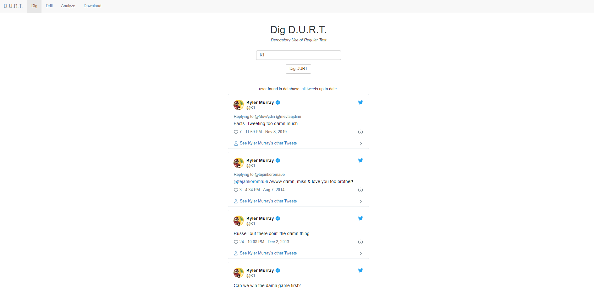
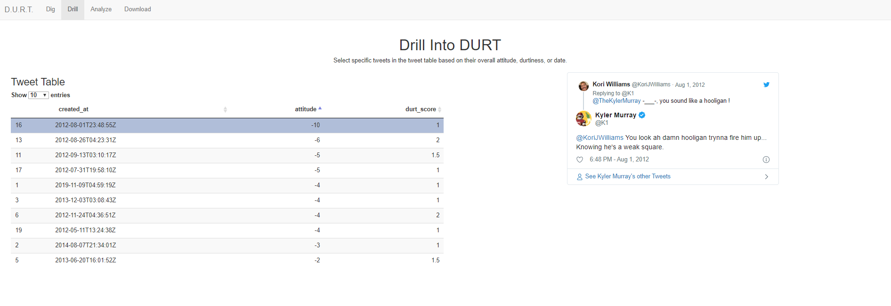
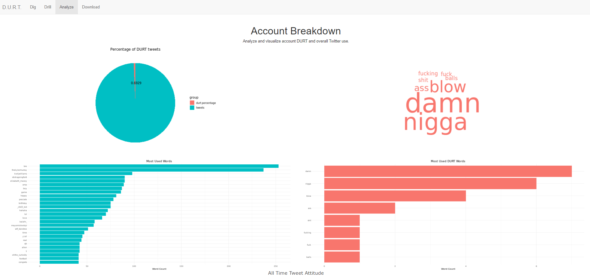
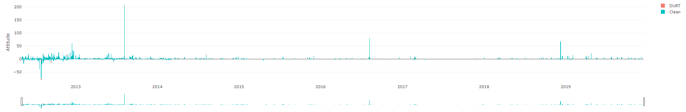
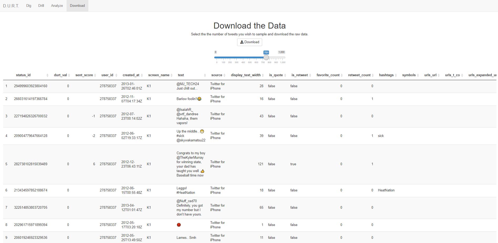

```{r setup, include=FALSE}
knitr::opts_chunk$set(echo = TRUE)
```

## Introduction

The internet is forever. Often, old tweets come to haunt professionals. When these controversial tweets surface, there is some type of public backlash and real-world consequence that follows. People who have ever tweeted derogatory or abusive messages stand to lose more than just a positive public perception. Just ask comedian <a href = 'https://www.theguardian.com/film/2018/dec/05/oscars-host-kevin-hart-homophobia-is-no-laughing-matter'>Kevin Hart</a>, or Brown's safety <a href = 'https://www.cnn.com/2019/11/04/us/cleveland-browns-whitehead-threat-trnd/index.html'> Jermaine Whitehead</a>. The Derogatory Use of Regular Text can ruin careers and defame organizations. 

A positive social media presence matters. Using a dictionary-based approach, DURT is a R Shiny application that allows the user to check twitter accounts for potentially unprofessional, derogatory, or otherwise offensive content. It also provides a general look at their overall twitter use. DURT makes a provides a straightforward open source solution designed to allow individuals or organizations to screen twitters. 


## Motivation

Twitter plays a significant role in recruiting college athletes. Coaches use Twitter to communicate to recruits and assess their character. They monitor recruits’ social media, and athletes can potential lose their opportunity at the next level based on their tweets. Even at the next level, a sudden spike in popularity can leave athletes vulnerable to exposure from old tweets. Cases like  <a href = 'https://www.cnn.com/2018/12/09/us/kyler-murray-tweets-apology/index.html'>Kyler Murray’s</a> reflect poorly on the athletic program, team, and individual. After sitting in social media awareness briefings, the issue became clearer, but the solution seemed incomplete. The only way to find all of one person’s potentially offensive tweets was to scroll through their Twitter. This process seemed inefficient. The goal of DURT is to fill the capability gap and provide an open sourced framework for finding offensive content on Twitter. While DURT was originally designed for athletes, anyone can use DURT to clean up their own profiles. Additionally, recruiters can use DURT to assess job candidates or athletes, college admissions officers can use DURT to assess applicants, and agents can use DURT to help their clients.  

## Related Work

The automated detection of offensive or abusive twitter content is a hot topic for researchers in artificial intelligence. Researchers have developed various machine learning models that screen collections of tweets for offensive language. Models that take a more natural language processing approach largely base themselves around <a href = 'https://arxiv.org/pdf/1809.08651'>N-gram, TFIDF</a>, and <a href = 'https://dl.acm.org/ft_gateway.cfm?id=2140539&ftid=1137474&dwn=1&CFID=91870580&CFTOKEN=5d648d2ac324210-A3B0EF48-C0EE-BB32-E5ABA49A645C46D5'>word pattern detection</a>. More complex ML models use <a href = 'https://arxiv.org/pdf/1801.04433'>recurrent neural networks and LTSM</a> to classify tweets. While many of these models exist, few implement them practically into an interface between a user and Twitter. Instead each model serves more like nuanced solution to a broad problem: people tweet words that make other people unhappy. Perhaps, researchers have overcomplicated the issue for experimental or developmental cause.

## DURT Methodology

The beauty of DURT is in the simplicity. DURT uses a dictionary-based approach to identify potentially derogatory tweets. If a person tweeted a word in the durt dictionary, DURT flags the tweet as durty. The dictionary-based approach is the most transparent method for screening tweets. Due to tagging and labeling for training purposes, ML models become more ambiguous in the rationale used to predict offensive language. However, the transparency of the dictionary approach makes identifying derogatory language straightforward. It’s easy to explain to clients or users how DURT flags a tweet. Because DURT uses a dictionary-based approach, it is also easy to change the tweets that DURT flags

The durt dictionary is meant to be a living collection of trigger words that varies based on user/client preference. Rather than using a static list of terms, the durt dictionary can evolve at the same pace language does. The trigger words in the durt dictionary can carry no negative connotation in themselves, or they can be definitively derogatory in nature. For example, because homophobia is such a common trend in resurfaced tweets, consider the words “faggot” and “gay.”  Because of its derogatory nature, using the word “faggot” is unacceptable under any circumstances. Somebody can tweet “I hate faggots” or “I love faggots,” and either is unacceptable. However, there is some context needed to assess tweets that contain the word “gay.” While somebody can tweet “I hate gay people,” which is totally offensive and completely inappropriate, someone can also tweet “I love gay people,” which is positive and accepting. Either way including both words into the durt dictionary is necessary to catch all potentially offensive tweets. This makes DURT is a high recall - low precision solution.

To sort through potentially offensive tweets, DURT allows the user to arrange tweets based on two criteria: sentiment score and durt value. The sentiment score reflects the overall attitude of the tweet, and the durt value represents the severity of the trigger word used in the tweet. This process lets the users filter out many of false positives created by the high recall rate of DURT. If a tweet has an overall negative attitude or uses a very vulgar word, then that tweet is more likely to be offensive. By allowing users to sort through potentially offensive content themselves, the user can interpret what language is acceptable and unacceptable on their own terms. Unlike ML models which make some decision based on previously tagged tweets, DURT does not bias toward the subjectivity of what is labeled “offensive” in a training set.

The code block below displays the durt base function. This function takes the data supplied through the twitter API and transforms it into data-frame used in DURT. The subtasks associated with the function are commented out in the code block. 

```{r}

build_durt_df <- function(df) {
  #add sentiment value to df
  tweet_sentiment <- df %>%
    unnest_tokens(word, text) %>%
    mutate(text = tolower(text)) %>%
    mutate(text = gsub("[[:punct:]]", " ", text)) %>%
    inner_join(get_sentiments('afinn')) %>%
    group_by(status_id) %>%
    summarize(sent_score = sum(value)) %>%
    right_join(df)
  #assign durt value to every durt tweet (all non-durt are NA)
  tweet_durt <- tweet_sentiment %>%
    select(text, status_id) %>%
    mutate(text = tolower(text)) %>%
    mutate(text = gsub("[[:punct:]]", " ", text)) %>%
    unnest_tokens(word, text) %>%
    filter(word %in% durtdict$word) %>%
    mutate(durtvalue = word %l% durtdict) %>%
    right_join(distinct(tweet_sentiment)) %>%
    group_by(status_id) %>%
    mutate(durt_val = sum(durtvalue, na.rm = TRUE)) %>%
    distinct(status_id, durt_val) %>%
    right_join(distinct(tweet_sentiment))
  #get the html requred to embed every durt tweet. (all non-durt are NA)
  tweet_final <- tweet_durt %>%
    filter(durt_val > 0) %>%
    mutate(embedlink = embedlist(status_url)) %>%
    select(status_id, embedlink) %>%
    right_join(tweet_durt)
  #add pull date column
  tweet_final <- tweet_final %>%
    mutate(pull_date = Sys.Date())
  
  return(data.frame(tweet_final))
}

```


## Databasing 

To ease the load of the API and increase performance, the app has a built-in databasing feature backed by MongoDB. Compared to some SQL databases, MonogoDB has a quick set-up time and high performance for simple queries. Additionally, because DURT involves interacting with the Twitter API, and NoSQL databases can store JSON-like data, implementing MongoDB fits DURTs requirements. By locally deploying MongoDB on the same server used to host the application, DURT can ping the database directly through R using <a href = 'https://jeroen.github.io/mongolite'> mongolite</a>. It’s also possible to use a separate cloud deployed server, but that comes with the headache of dealing with SSL authentication and shh tunneling. The following code block displays how the application interacts with the database. 

```{r message=FALSE, warning=FALSE, paged.print=FALSE, eval= FALSE}
tweetsdb <- mongo('database')

  dat <- reactiveValues()
  
  observeEvent(input$go_button, {
    
    dat$durt <- NULL
    name <- input$user
    query <- paste('{"screen_name":',paste0('"',name,'"'),'}')
    
    if(tweetsdb$count(query) == 0){
      tweets <- get_timeline(name , n = 10000)
      output$text <- renderText('user not found in database')
      
      if(nrow(tweets) > 1) {
        output$text <- renderText('user found on twitter, getting durt')
        durtdf <- build_durt_df(tweets)
        #tweetsdb$insert(durtdf) #adds full df to database
        dat$durt <- data.frame(durtdf)
        
      } else {
        output$text <- renderText('user not on twitter or is private')
      }
      
    } else {
      output$text <- renderText('user found in database, getting durt')
      tweets <- data.frame(tweetsdb$find(query))
      output$text <- renderText('user found in database, updating durt')
      
      if ((as.Date(tweets$created_at[1], format = "%m-%d-%Y") + 7 > as.Date(tweets$pull_date[1])) == FALSE) {
        
        new_tweets <- get_timeline(name, n = 10000 , since_id = (tweets$status_id[1]))
        
        if (nrow(new_tweets) > 1){
          new_tweets <- build_durt_df(new_tweets)
          all_tweets <- rbind(new_tweets, tweets)
          dat$durt <- all_tweets
          tweetsdb$remove({query})
          tweetsdb$insert(all_tweets)
        } else{
          output$text <- renderText('user found in database. all tweets up to date.')
          dat$durt <- tweets
        } 
      } else{
        output$text <- renderText('user found in database. all tweets up to date.')
        dat$durt <- tweets
      }
      
    }
  })

```

## DURT Interface

The following section will outline DURT's user interface.



The first tab open when the launches DURT is the "Dig" tab. This tab allows the user to enter a twitter handle into the search bar, and click search to display all durty tweets from the user searched.



The next tab, "Drill," allows the user to sort through potentially offensive tweets. The user can select specific tweets in the tweet table based on their overall attitude, durtiness, or date by manipulating the datatable in the application. The tweet selected in the table on the left will appear on the right. This tab will only populate after the user searches for a Twitter account on the "Dig" tab, otherwise it returns an error. 




The tab “Analyze” allows the user to analyze and visualize the searched account’s DURT and overall twitter use. The top left figure is a pie chart that displays the percentage of tweets that DURT flagged. The bottom left figure is a bar chart of the top 25 most frequently used words for the searched account. The user can gain a general idea of the searched account’s Twitter use by examining the first two charts. The figures on the right are more DURT related. Both the word cloud and the bar chart display the account’s most often used trigger words. The figure at the very bottom of the page is an interactive stacked bar chart that plots tweet sentiment over time. Durty tweets pop red on the the chart. This gives the user a simple way to determine the searched account’s overall tweet attitude, and quickly assess the context that the searched account tweets using a trigger word.



The last tab, “Download,” allows the user to select a random sample of tweets on the slider and download that sample into a csv file. The user can select up to 1,000 tweets to download. 

## Limitations and Future Work

In an application, the primary limitation of DURT is reliance on the Twitter REST API. The API only allows access up to 3200 individual user tweets, and 18000 total tweets every fifteen minutes before hitting rate limits. We tried to circumvent this issue by implement the database. Theoretically, we can cycle API keys to pull more data, but that is against Twitter's terms of use.

DURT works well 'out of the box' but to be more effective for future clients, it can use some back-end work. This work includes, pre-loading tweets for specific users into database or altering the durt dictionary as needed. By loading tweets into the database, clients don't have to touch the API for every search, and the app displays results much faster. Specifying the dictionary makes it simple to meet client requests. For example, if a client was only interested in Racist tweets, we can specify the DURT dictionary to include only race biased words. Overall, the back-end work associated with improving client experience is a light lift that yields big gains.

In the future we can run tests that compare the DURT results to various ML Models results. These tests will allow us to quantify the difference between DURT and other high-end models. DURT does not have to outperform these models in sacrifice of method transparency and high recall. Afterall, because the entire concept of offensiveness is subjective a high recall solution works best. However, it would be helpful to know the language used in the false negatives DURT does not catch. 


## Conclusion

DURT is a straightforward solution for a real-world problem. By implementing R-Shiny, MongoDB and the Twitter API in an application, DURT provides an open sourced framework for finding offensive tweets. Compared to ML models DURT may have higher recall and lower precision. Although, DURT lacks precision, it makes up for it by having an easily communicated and transparent methodology. Individuals, recruiters, and anyone else can use DURT to find potential offensive or unprofessional tweets on any public Twitter user.

All the code for DURT is on <a href = "https://github.com/nicomanzonelli/durt">github.com/nicomanzonelli/durt</a>.

USMA Systems Department hosts the app at <a href = 'durt.dse-apps.com'> durt.dse-apps.com </a>

